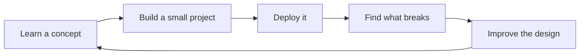

<div align="center">

# 👋 Hey, I'm Mayantha Udayanga

### `Software Engineering` × `Computer Science` × `Applied AI`


<br/>

<a href="https://github.com/Mayanthaz">
  
</a>
<a href="https://github.com/Mayanthaz?tab=followers">
  
</a>

</div>

---

## 🧠 Who I Am

I'm a **Software Engineering student** building my foundation across **Computer Science and Applied AI**.

I enjoy going beyond writing code — I like understanding **how systems work, how data moves, how products are built, and how AI can make them smarter**.

> **My mindset:** Learn → Build → Break → Improve → Repeat.

Currently, I'm focused on becoming a stronger **full-stack/backend engineer with practical AI skills**, while building projects that are useful outside the classroom.

---

## 🎯 What I'm Exploring

```text
Software Engineering   ████████████████████  Core
Backend Development    ██████████████████░░  Growing
Artificial Intelligence ████████████████░░░░  Exploring
Machine Learning       ██████████████░░░░░░  Exploring
Cloud & DevOps         ████████████░░░░░░░░  Growing
System Design          ██████████░░░░░░░░░░  Learning
```

### Areas I love working with

- 🤖 **Applied AI & Machine Learning** — intelligent features, prediction systems, automation
- ⚙️ **Backend Engineering** — REST APIs, business logic, databases, scalable services
- 🌐 **Full-Stack Development** — turning ideas into usable web applications
- 🧩 **Software Engineering** — OOP, architecture, debugging, testing, clean code
- ☁️ **Cloud & Deployment** — Git, CI/CD, containers, hosting and production workflows

---

## 🛠️ My Toolbox

### Languages

<p>

</p>

### Frameworks & Development

<p>

</p>

### Data, Cloud & Tools

<p>

</p>

---

## 🚀 Things I'm Building

<table>
<tr>
<td width="50%">

### 🤖 AI Projects
Exploring practical machine learning applications and AI-powered tools that turn raw data into useful decisions.

</td>
<td width="50%">

### ⚡ Backend Systems
Building APIs, management systems, authentication flows, database-driven applications and automation services.

</td>
</tr>
<tr>
<td width="50%">

### 🌐 Full-Stack Apps
Connecting clean interfaces with reliable backend services to create complete end-to-end products.

</td>
<td width="50%">

### 🔧 Developer Experiments
Trying new technologies, deployment platforms, libraries and ideas to learn by building.

</td>
</tr>
</table>

---

## 📌 Featured Work

> A few areas you'll find across my repositories:

**Daily Focus Predictor** — a full-stack ML application focused on predicting daily focus levels and presenting model-driven insights through a web dashboard.

**Java Management Systems** — desktop and backend projects built around OOP, database integration, CRUD workflows and practical software engineering patterns.

**Spring Boot Applications** — REST APIs and business applications designed around layered architecture and relational databases.

**Automation & Bots** — experiments involving APIs, Telegram bots, cloud deployment and workflow automation.

---

## 📊 GitHub Activity

<div align="center">


<br/>


</div>

---

## 🧪 Current Learning Loop



I believe the fastest way to improve is to **turn theory into working software**.

---

## 🌱 2026 Focus

- Deepen my **Computer Science & Software Engineering fundamentals**
- Build stronger **Applied AI / ML projects**
- Improve **backend architecture and system design**
- Learn better **cloud, deployment and DevOps practices**
- Build projects that demonstrate **real engineering, not just tutorials**
- Keep contributing to my GitHub with meaningful work

---

## 🤝 Let's Connect

<div align="center">

<a href="mailto:mayantha743@gmail.com">

</a>
<a href="https://www.linkedin.com/in/mayanthaudayanga/">

</a>
<a href="https://github.com/Mayanthaz">

</a>

<br/><br/>

### 💡 Build something useful. Make it better. Ship it.

</div>

---

<div align="center">

<sub>Designed around curiosity, engineering, and the habit of building. 🚀</sub>

</div>
